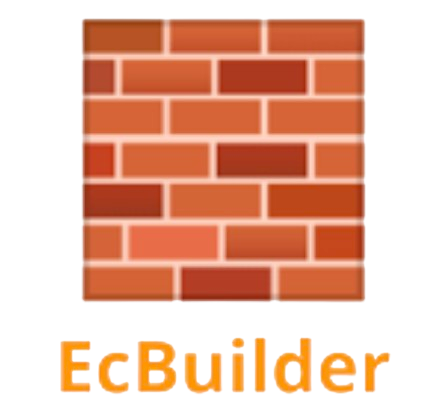

    

<h1 align="center">
  EcBuilder - Simple Website Builder
</h1>

    

A landing page builder, built with laravel, and react (with typescript). It demonstrates a simple interface to choose components and color pallete for the page, and export it as a full react project.

<h2 id="demo"> 🚀 Demo </h2>

https://github.com/OmarMHawash/ecBuilder/assets/81506354/b6345cff-37dc-4ac8-9edf-85a90131ea5e
